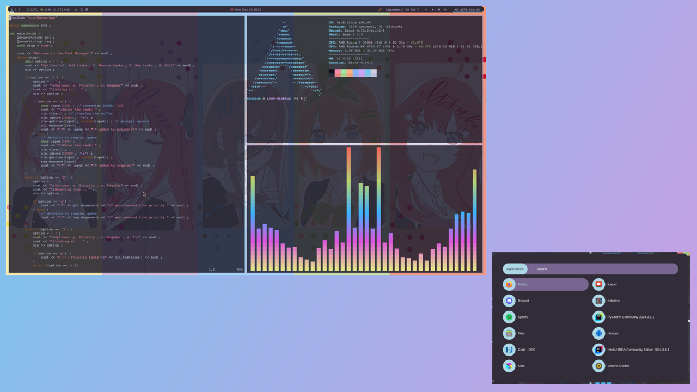

# SanicSquirtle420's dotfiles
- OS: [Arch Linux](https://archlinux.org)         
- WM: i3

## Pictures
#### Preview

Picture Taken: Dec 29, 2025

## How to use my dotfiles
I have created an install script `install-dotfiles.sh` to take care of the setup process. Before using the setup script download the following dependecies. You don't have to worry about the `pulseaudio-control` or `zscroll` setup because that is included in the install script. 

```bash
i3 playerctl rofi picom lxappearance pulseaudio pavucontrol polybar kitty fastfetch python3 python-setuptools
```
[nitrogen](https://aur.archlinux.org/packages/nitrogen) [pulseaudio-control](https://github.com/marioortizmanero/polybar-pulseaudio-control) [zscroll](https://github.com/noctuid/zscroll)

## To use the script
```bash
cd ~/Downloads/
git clone https://github.com/sanicsquirtle420/dotfiles.git
cd dotfiles/.scripts/
chmod +x install-dotfiles.sh
./install-dotfiles.sh
```

## Themes
To see preview images of my themes go to the [dotfiles](https://sanicsquirtle420.github.io/#/dotfiles) section on my GitHub pages website.

## Fonts Used:
- [Arimo Nerd Font](https://github.com/ryanoasis/nerd-fonts/releases/download/v3.2.1/Arimo.zip)
- [AurulentSansMono Nerd Font](https://github.com/ryanoasis/nerd-fonts/releases/download/v3.2.1/AurulentSansMono.zip)
- [Noto Sans JP](https://fonts.google.com/noto/specimen/Noto+Sans+JP) (for Japanese Symbols)
- [Noto Sans KR](https://fonts.google.com/noto/specimen/Noto+Sans+KR) (for Korean Symbols)